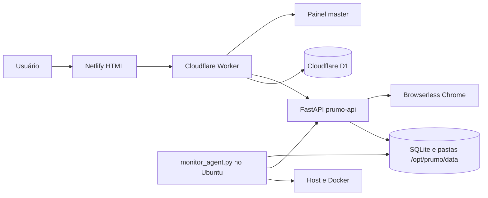

# Prumo ISS Fortaleza

Versão: **1.0.29 - Retry automatico seguro e feedback de acoes lentas**

Central operacional da Prumo Sistemas para executar automações de ISS Fortaleza com isolamento por empresa e colaborador.

## Arquitetura



- **Netlify** publica os HTMLs da raiz.
- **Cloudflare Worker** autentica, aplica roles, mantém empresas, usuários, sessões, logs e jobs de exclusão no D1.
- **FastAPI** guarda conjuntos, credenciais ISS criptografadas, runs e arquivos no volume persistente.
- **Browserless** fornece os navegadores Chrome usados pelo Playwright via CDP remoto.
- **Monitor agent** roda diretamente no Ubuntu, inspeciona host e containers e grava cinco dias de métricas.

## Estrutura

| Caminho | Responsabilidade |
| --- | --- |
| `index.html`, `login.html`, `admin.html`, `iss-fortaleza.html` | Entrada, autenticação, painel administrativo e execução das automações. |
| `master.html`, `master-company.html` | Gestão master, inspeção detalhada de empresas, logs e infraestrutura. |
| `cloudflare/worker.js` | API pública, autenticação, D1, proxy interno e reconciliação de exclusões. |
| `cloudflare/wrangler.toml.example` | Template de publicação Wrangler e Cron Trigger. |
| `server/main.py` | Rotas FastAPI, resumos administrativos, limpeza segura e telemetria interna. |
| `server/domain.py`, `server/run_queue.py` | Persistência por colaborador, runs, fila justa e workers globais. |
| `server/flow_*.py` | Fluxos Certidão, DAM, Escrituração e Notas. |
| `deploy/docker-compose.yml` | Containers `browserless` e `prumo-api`. |
| `deploy/monitor_agent.py` | Coletor de CPU, RAM, disco, Docker, fila e erros. |

## Armazenamento

O servidor grava dados em `/opt/prumo/data`, montado como `/app/output` no container:

```text
/opt/prumo/data/
  _api_data/iss_automacao.db
  _monitor/metrics.sqlite3
  _monitor/latest.json
  empresas/<company_id>/colaboradores/<user_id>/runs/
```

O SQLite da API usa chaves `empresa:<company_id>:membro:<user_id>:<recurso>`. Credenciais ISS e snapshots de execução são criptografados usando uma chave derivada de `ISS_INTERNAL_SECRET`.

## Suspensão E Exclusão

- Desativar empresa bloqueia colaboradores e solicita parada das runs. O administrador continua entrando em modo somente leitura.
- Reativar empresa libera colaboradores que não estavam desativados individualmente.
- Excluir colaborador ou empresa cria um job idempotente no D1.
- O Worker bloqueia acesso imediatamente e reconcilia a exclusão a cada minuto.
- A API remove fila pendente, KV, memória e pastas somente depois que nenhum worker ainda estiver escrevendo.
- Jobs concluídos permanecem no D1 por 30 dias para auditoria.

## Primeiro Deploy

### 1. Resetar O D1 De Teste

Esta versão adiciona o schema definitivo `deletion_jobs`. O banco atual é descartável: apague manualmente o D1 de teste e crie um novo banco antes do setup. Não aplique migrations de compatibilidade.

Copie `cloudflare/wrangler.toml.example` para `cloudflare/wrangler.toml`, preencha `database_id` e mantenha o arquivo fora do Git.

```bash
cd cloudflare
npx wrangler d1 create prumo-sistema
npx wrangler secret put ISS_INTERNAL_SECRET
npx wrangler secret put SETUP_TOKEN
npx wrangler secret put ADMIN_EMAIL
npx wrangler secret put ADMIN_PASSWORD
npx wrangler deploy
```

Depois do deploy, execute `/api/setup?token=<SETUP_TOKEN>` uma vez e remova `SETUP_TOKEN`.

### 2. Fixar Imagens Docker

Descubra e registre o digest da imagem Browserless já testada no servidor:

```bash
docker pull browserless/chrome
docker image inspect browserless/chrome --format '{{index .RepoDigests 0}}'
```

Copie `deploy/.env.example` para `/opt/prumo/config/prumo-api.env`, ajuste segredos e informe `BROWSERLESS_IMAGE` com digest. Nunca use `latest` em produção.

### 3. Subir Containers

```bash
cd /opt/prumo/app/deploy
cp /opt/prumo/config/prumo-api.env .env
docker compose --env-file .env up -d
docker compose ps
```

O Browserless e a API ficam disponíveis apenas no loopback do Ubuntu. Publique a API para o Worker por um proxy HTTPS controlado.

O Compose configura 13 sessões locais concorrentes, fila para 30 conexões aguardando e timeout de 20 minutos. Esses limites evitam rejeições `429` prematuras e reduzem encerramentos de navegador em fluxos longos; acompanhe CPU, RAM e fila no painel master antes de ampliar a concorrência. A referência oficial das variáveis está na [documentação Docker do Browserless](https://docs.browserless.io/enterprise/docker/config).

Para somar capacidade externa sem sobrecarregar o Browserless local, configure `BROWSER_CDP_POOL` no formato `label|capacidade|url`, separado por `;;`. Exemplo: `browserless-local|13|ws://browserless:3000?token=...;;modal-turbo|32|wss://...modal.run?token=...`. Quando o pool estiver ativo, a API distribui novas sessões por peso e a tela ISS Fortaleza mostra o total com o chip `+N turbo`. Em produção, o limite atual e `13 locais + 32 Modal com proxy = 45 navegadores`, protegido por `MAX_BROWSER_LIMIT`.

Se um alvo externo precisar sair por proxy, configure `BROWSER_PROXY_MAP` com `label|proxy_url`, separado por `;;`. Para `modal-turbo`, prefira o modo embutido: o Browserless Modal sobe `cloudflared access tcp`, expoe a proxy do servidor em `127.0.0.1:31480` dentro do container e injeta `--proxy-server=http://127.0.0.1:31480` no Chrome. Isso evita que o `APIRequestContext` do Playwright tente usar a proxy local do container a partir da API no servidor.

O app Modal versionado em `deploy/modal_browserless.py` usa a mesma imagem Browserless digestada do servidor e espera um Secret Modal chamado `prumo-browserless` contendo `TOKEN=<token>`. Publique com `modal deploy deploy/modal_browserless.py`.

#### Turbo Modal Browserless

O Modal direto continua bloqueado pelo GEO-IP do portal no login. O modo aprovado usa `cloudflared access tcp` dentro do Browserless Modal e a proxy HTTP CONNECT do servidor, saindo pelo IP `45.165.22.179`. O teste sintético do app `prumo-browserless-loadtest-multi` validou estes pontos sem falhas de CDP:

| Configuração | Paralelo | Resultado | Tempo total | p95 |
| --- | ---: | --- | ---: | ---: |
| 1 container | 8 | 8/8 OK | 7.83s | n/d |
| 1 container | 12 | 12/12 OK | 15.48s | n/d |
| 1 container | 16 | 16/16 OK | 20.17s | n/d |
| 2 containers x 8 | 16 | 16/16 OK | 8.43s | 7.91s |
| 2 containers x 8 | 48 | 48/48 OK | 23.53s | 22.93s |
| 4 containers x 8 | 48 | 48/48 OK | 13.15s | 12.50s |
| 4 containers x 8 | 64 | 64/64 OK | 16.25s | 15.81s |
| 4 containers x 8 | 96 | 96/96 OK | 22.95s | 22.13s |

O custo observado no ciclo Jun 1 - Jul 1, 2026 para o loadtest foi US$ 0.02 de CPU. Em 2026-06-25, o probe `deploy/modal_proxy_probe.py` confirmou `exit_ip=45.165.22.179` e `iss_status=200` a partir do Modal. O teste CDP real abriu `/grpfor/oauth2/login` via `modal-turbo` com `#username` visivel e sem GEO-IP. A execucao pequena `run_AXl3qXA8SK_bFNBncNUt_A` tambem confirmou `target=modal-turbo proxy=on`: o login passou e os erros ocorreram depois em `Pesquisar Empresa`, nao no login/proxy. Em seguida, a versao 1.0.18 moveu a proxy para o launch arg do Chrome, porque proxy no contexto Playwright tambem afetava `APIRequestContext`. A versao 1.0.22 mantem o Modal em +32, distribui a carga em 8 containers x 4 sessoes, aumenta a rampa de conexao para `modal-turbo`, usa 2 retries curtos para erros transitorios, sobe o timeout Browserless para 20 minutos e classifica `TimeoutError` vazio como `TIMEOUT` retryable. A versao 1.0.24 adiciona `PORTAL_REQUESTS_BOOTSTRAP`: antes do Playwright, a API tenta login Keycloak e selecao da empresa por requests, injeta os cookies no browser e abre `home.seam?cid=...`; falhas tecnicas caem automaticamente para o login/selecao antigos, mas erros definitivos do portal como `MENSAGEM_NA_TELA`, `CNPJ_MISMATCH`, `CNPJ_INEXISTENTE` e `LOGIN_ERROR` permanecem nao retryable. A versao 1.0.25 organiza o servidor, reduz o Browserless local para 13 sessoes e mantem o turbo Modal em +32, totalizando 45 navegadores. A versao 1.0.26 estabiliza a home apos bootstrap/seleção de empresa, fecha o modal benigno `Pesquisa Sefin` com `Nao`, preserva `MENSAGEM_NA_TELA` como erro definitivo e remove mascaras RichFaces/AJAX quebradas antes de acessar Escrituração, NFS-e e DAM. A versao 1.0.27 espera o resultado de `Consultar` na Escrituração antes de procurar `Escriturar/Reabrir` e classifica recarga no meio da ação como `NAVIGATION_RACE` retryable. A versao 1.0.28 considera a tela `Escrituração Fiscal` já aberta como sucesso, aguarda estabilidade por leituras consecutivas e evita falso erro quando o portal conclui a navegação durante o passo. A versao 1.0.29 adiciona retry automatico seguro, preselecionado na criacao da run e limitado por `AUTO_RETRY_MAX_ATTEMPTS`, mantendo fora erros definitivos como CNPJ inexistente, mensagem na tela, mismatch e login; tambem adiciona loaders locais nos downloads e na paginacao da run selecionada.

### 4. Instalar Monitoramento

```bash
sudo mkdir -p /opt/prumo/config
sudo cp deploy/monitor-agent.env.example /opt/prumo/config/monitor-agent.env
sudo cp deploy/prumo-monitor.service /etc/systemd/system/
sudo systemctl daemon-reload
sudo systemctl enable --now prumo-monitor
sudo systemctl status prumo-monitor
```

O agente coleta ao vivo a cada 10 segundos e persiste uma amostra a cada 30 segundos. A retenção é de cinco dias; o painel reduz os pontos mais antigos preservando picos para continuar leve.

## Netlify

Publique a raiz do repositório. Não defina diretório de build. `404.html` é a página de erro utilizada automaticamente pelo Netlify.

## Backup

Faça backup de `/opt/prumo/data` com os containers parados ou utilizando snapshots consistentes do volume:

```bash
docker stop prumo-api
sudo tar -czf /opt/prumo/backups/prumo-data-$(date +%F-%H%M).tar.gz /opt/prumo/data
docker start prumo-api
```

O D1 deve ser exportado separadamente com Wrangler.

## Diagnóstico

```bash
docker compose -f deploy/docker-compose.yml ps
docker logs --tail 200 prumo-api
docker logs --tail 200 browserless
systemctl status prumo-monitor
journalctl -u prumo-monitor -n 200 --no-pager
curl http://127.0.0.1:8000/
curl -H "X-Internal-Secret: <SEGREDO>" http://127.0.0.1:8000/api/internal/runtime-metrics
```

No painel master, a área **Logs** mostra CPU, RAM, disco, containers, navegadores, fila e erros. Cada empresa possui sua própria tela de inspeção com usuários, CNPJs, contas ISS, runs e integridade das pastas.

## Segurança

- Não versione `.env`, `wrangler.toml`, tokens ou dumps SQLite.
- Use valores distintos para `BROWSERLESS_TOKEN` e `ISS_INTERNAL_SECRET`.
- Restrinja o proxy HTTPS da API para uso do Worker.
- Mantenha o monitor agent no host; não monte o socket Docker dentro do container da API.


### Bloqueio GEO-IP no Login

O login do ISS Fortaleza pode devolver uma tela `Forbidden` com `GEO-IP Filter Alert` para IPs de cloud. A API classifica esse caso como `PORTAL_ACCESS_BLOCKED`, em vez de esperar o seletor de login ate virar `TIMEOUT`. Enquanto esse bloqueio existir, nao habilite `modal-turbo` no `BROWSER_CDP_POOL` sem proxy ou IP de saida aceito pelo portal.

Teste de rede em 2026-06-25:

- Modal direto conectou no Browserless, mas o portal bloqueou o IP de origem cloud no login.
- Proxy HTTP CONNECT no servidor funcionou no host e saiu pelo IP `45.165.22.179`.
- A porta direta `31380` nao ficou acessivel de fora; Cloudflare Tunnel HTTP nao repassa `CONNECT` como proxy HTTP comum.
- O caminho funcional e `cloudflared access tcp` para `modal-proxy.prumosistemas.com.br`, expondo uma proxy loopback sem auth em `127.0.0.1:31480` dentro do container Modal. A origem real no servidor fica em `127.0.0.1:31381`, limitada por dominio e inacessivel diretamente pela internet.
