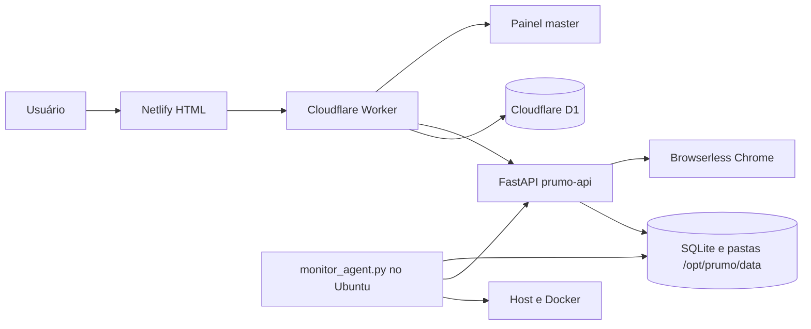

# Prumo ISS Fortaleza

Versão: **1.0.0 - Produção Inicial**

Central operacional da Prumo Sistemas para executar automações de ISS Fortaleza com isolamento por empresa e colaborador.

## Arquitetura



- **Netlify** publica os HTMLs da raiz.
- **Cloudflare Worker** autentica, aplica roles, mantém empresas, usuários, sessões, logs e jobs de exclusão no D1.
- **FastAPI** guarda conjuntos, credenciais ISS criptografadas, runs e arquivos no volume persistente.
- **Browserless** fornece os navegadores Chrome usados pelo Playwright via CDP remoto.
- **Monitor agent** roda diretamente no Ubuntu, inspeciona host e containers e grava cinco dias de métricas.

## Estrutura

| Caminho | Responsabilidade |
| --- | --- |
| `index.html`, `login.html`, `admin.html`, `iss-fortaleza.html` | Entrada, autenticação, painel administrativo e execução das automações. |
| `master.html`, `master-company.html` | Gestão master, inspeção detalhada de empresas, logs e infraestrutura. |
| `cloudflare/worker.js` | API pública, autenticação, D1, proxy interno e reconciliação de exclusões. |
| `cloudflare/wrangler.toml.example` | Template de publicação Wrangler e Cron Trigger. |
| `server/main.py` | Rotas FastAPI, resumos administrativos, limpeza segura e telemetria interna. |
| `server/domain.py`, `server/run_queue.py` | Persistência por colaborador, runs, fila justa e workers globais. |
| `server/flow_*.py` | Fluxos Certidão, DAM, Escrituração e Notas. |
| `deploy/docker-compose.yml` | Containers `browserless` e `prumo-api`. |
| `deploy/monitor_agent.py` | Coletor de CPU, RAM, disco, Docker, fila e erros. |

## Armazenamento

O servidor grava dados em `/opt/prumo/data`, montado como `/app/output` no container:

```text
/opt/prumo/data/
  _api_data/iss_automacao.db
  _monitor/metrics.sqlite3
  _monitor/latest.json
  empresas/<company_id>/colaboradores/<user_id>/runs/
```

O SQLite da API usa chaves `empresa:<company_id>:membro:<user_id>:<recurso>`. Credenciais ISS e snapshots de execução são criptografados usando uma chave derivada de `ISS_INTERNAL_SECRET`.

## Suspensão E Exclusão

- Desativar empresa bloqueia colaboradores e solicita parada das runs. O administrador continua entrando em modo somente leitura.
- Reativar empresa libera colaboradores que não estavam desativados individualmente.
- Excluir colaborador ou empresa cria um job idempotente no D1.
- O Worker bloqueia acesso imediatamente e reconcilia a exclusão a cada minuto.
- A API remove fila pendente, KV, memória e pastas somente depois que nenhum worker ainda estiver escrevendo.
- Jobs concluídos permanecem no D1 por 30 dias para auditoria.

## Primeiro Deploy

### 1. Resetar O D1 De Teste

Esta versão adiciona o schema definitivo `deletion_jobs`. O banco atual é descartável: apague manualmente o D1 de teste e crie um novo banco antes do setup. Não aplique migrations de compatibilidade.

Copie `cloudflare/wrangler.toml.example` para `cloudflare/wrangler.toml`, preencha `database_id` e mantenha o arquivo fora do Git.

```bash
cd cloudflare
npx wrangler d1 create prumo-sistema
npx wrangler secret put ISS_INTERNAL_SECRET
npx wrangler secret put SETUP_TOKEN
npx wrangler secret put ADMIN_EMAIL
npx wrangler secret put ADMIN_PASSWORD
npx wrangler deploy
```

Depois do deploy, execute `/api/setup?token=<SETUP_TOKEN>` uma vez e remova `SETUP_TOKEN`.

### 2. Fixar Imagens Docker

Descubra e registre o digest da imagem Browserless já testada no servidor:

```bash
docker pull browserless/chrome
docker image inspect browserless/chrome --format '{{index .RepoDigests 0}}'
```

Copie `deploy/.env.example` para `/opt/prumo/config/prumo-api.env`, ajuste segredos e informe `BROWSERLESS_IMAGE` com digest. Nunca use `latest` em produção.

### 3. Subir Containers

```bash
cd /opt/prumo/app/deploy
cp /opt/prumo/config/prumo-api.env .env
docker compose --env-file .env up -d
docker compose ps
```

O Browserless e a API ficam disponíveis apenas no loopback do Ubuntu. Publique a API para o Worker por um proxy HTTPS controlado.

O Compose configura 15 sessões concorrentes, fila para 30 conexões aguardando e timeout de 10 minutos. Esses limites evitam rejeições `429` prematuras; acompanhe CPU, RAM e fila no painel master antes de ampliar a concorrência. A referência oficial das variáveis está na [documentação Docker do Browserless](https://docs.browserless.io/enterprise/docker/config).

### 4. Instalar Monitoramento

```bash
sudo mkdir -p /opt/prumo/config
sudo cp deploy/monitor-agent.env.example /opt/prumo/config/monitor-agent.env
sudo cp deploy/prumo-monitor.service /etc/systemd/system/
sudo systemctl daemon-reload
sudo systemctl enable --now prumo-monitor
sudo systemctl status prumo-monitor
```

O agente coleta ao vivo a cada 10 segundos e persiste uma amostra a cada 30 segundos. A retenção é de cinco dias; o painel reduz os pontos mais antigos preservando picos para continuar leve.

## Netlify

Publique a raiz do repositório. Não defina diretório de build. `404.html` é a página de erro utilizada automaticamente pelo Netlify.

## Backup

Faça backup de `/opt/prumo/data` com os containers parados ou utilizando snapshots consistentes do volume:

```bash
docker stop prumo-api
sudo tar -czf /opt/prumo/backups/prumo-data-$(date +%F-%H%M).tar.gz /opt/prumo/data
docker start prumo-api
```

O D1 deve ser exportado separadamente com Wrangler.

## Diagnóstico

```bash
docker compose -f deploy/docker-compose.yml ps
docker logs --tail 200 prumo-api
docker logs --tail 200 browserless
systemctl status prumo-monitor
journalctl -u prumo-monitor -n 200 --no-pager
curl http://127.0.0.1:8000/
curl -H "X-Internal-Secret: <SEGREDO>" http://127.0.0.1:8000/api/internal/runtime-metrics
```

No painel master, a área **Logs** mostra CPU, RAM, disco, containers, navegadores, fila e erros. Cada empresa possui sua própria tela de inspeção com usuários, CNPJs, contas ISS, runs e integridade das pastas.

## Segurança

- Não versione `.env`, `wrangler.toml`, tokens ou dumps SQLite.
- Use valores distintos para `BROWSERLESS_TOKEN` e `ISS_INTERNAL_SECRET`.
- Restrinja o proxy HTTPS da API para uso do Worker.
- Mantenha o monitor agent no host; não monte o socket Docker dentro do container da API.
