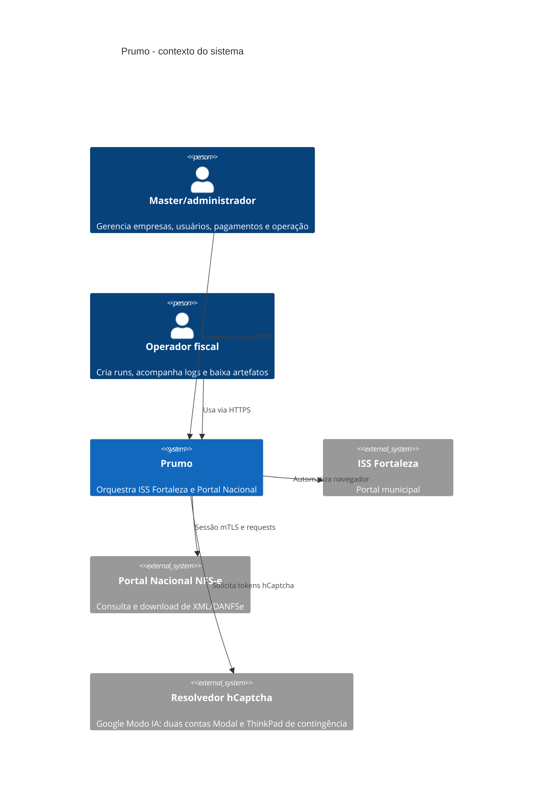
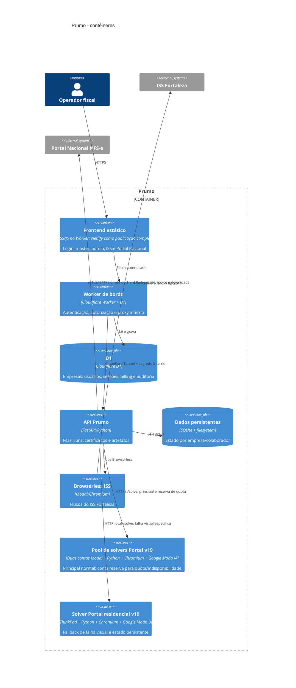
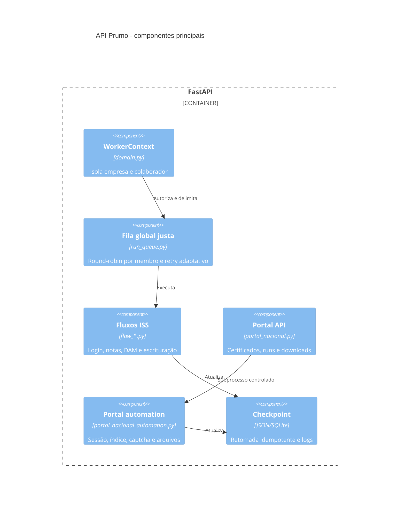
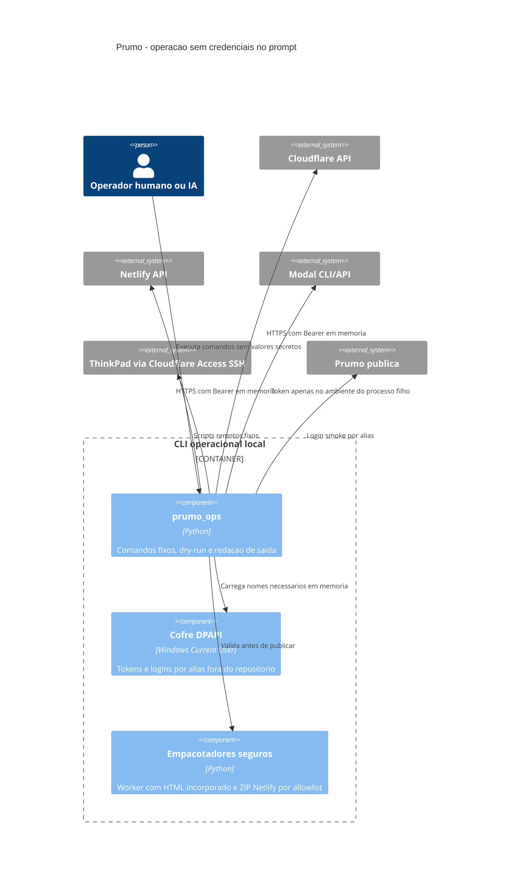

# C4 do Prumo

## Nível 1 - contexto

## Nível 2 - contêineres

## Nível 3 - componentes da API

## Nível 3 - plano operacional local

## Decisões arquiteturais

- ISS usa Modal direto por padrão porque o A/B real mostrou menor latência e menos falhas DNS; a proxy continua como fallback.
- O ThinkPad autentica no Portal Nacional diretamente em `certificado.nfse.gov.br`, indexa as notas e baixa os arquivos. Apenas a resolução visual do hCaptcha vai para o Modal. Não há proxy no caminho normal do Portal.
- Se o Modal principal atingir quota, retornar circuito aberto ou ficar indisponível, a resolução segue para a segunda conta Modal. Uma falha visual isolada segue direto para `127.0.0.1:8876`, sem cobrar a mesma tentativa na conta reserva e sem bloquear as outras notas; apenas 429, 5xx, circuito aberto ou falha de transporte colocam o endpoint em cooldown. O PFX, a senha e a sessão do Portal nunca são enviados ao Modal.
- O único provedor visual é o Google Modo IA. Não há Florence nem Cohere e não há resolvedores separados para 9 tiles e outros formatos: um contrato visual único escolhe `selecionar_regioes` ou `clicar_ponto`; somente o adaptador mecânico de clique muda conforme o DOM. O código fica em `solver/google_ai_mode`; estado anônimo fica em Volume privado no Modal e no ThinkPad.
- Cada conta Modal pode escalar até quatro containers com um navegador e uma entrada ativa por container. A principal mantém um container e um buffer; a reserva escala a zero. O Portal usa cooldown independente por endpoint e backoff crescente quando o serviço externo está degradado. A v19 também recria o widget preso com espera crescente, classifica `visual_challenge_not_opened` separadamente e sanitiza URLs antes de persistir erros.
- A concorrência do Portal é fixada pelo backend em quatro tarefas por colaborador e não é controlada pelo HTML. Cada colaborador tem runtime, sessão, certificado, índice e downloads próprios; dois colaboradores podem executar simultaneamente e compartilham apenas a capacidade enfileirada dos solvers.
- O XML concluído é checkpointado mesmo quando o PDF da mesma nota falha. O Modal recarrega e publica sessões Modo IA recuperadas no Volume privado; a recuperação Chrome usa uma tentativa curta e não ocupa todo o prazo do captcha. Logs e imagens são publicados periodicamente no Volume de debug e expiram em sete dias.
- Login, master e admin são servidos pelo mesmo Worker da API com `no-store`, evitando divergência de versão quando o Netlify está sem créditos. O GitHub continua sendo a fonte; o auto-deploy Netlify pode voltar sem mudar a arquitetura.
- Artefatos visuais ficam por sete dias, mas HTML/JSON/texto são gzipados e PNG vira WebP lossless após 15 minutos. XML/PDF das empresas não entram nessa limpeza. Logs Docker têm rotação de 3 arquivos de 10 MiB.
- A UI do ISS consulta apenas 20 mil caracteres recentes; o servidor mantém cache incremental por CNPJ/fluxo para mostrar novos logs sem reler o arquivo inteiro.
- Certificados são validados antes de entrar na run; falha de descriptografia nunca vira senha vazia silenciosa.
- Operacao local usa `python -m ops.prumo_ops`: o cofre DPAPI fica fora do Git, Cloudflare e Netlify usam API REST, Modal recebe token somente no ambiente filho e logins sao referenciados por alias. Wrangler e troca global de perfil Modal nao fazem parte do caminho canonico.
- No Portal Nacional, o ThinkPad divide o período por mês em janelas inclusivas de até 30 dias, limite aceito pelo site. Cada janela só é aceita quando a quantidade de IDs capturados coincide com o total do Portal; depois os IDs são unidos e deduplicados. A competência não é filtrada, portanto notas retroativas permanecem no resultado.
