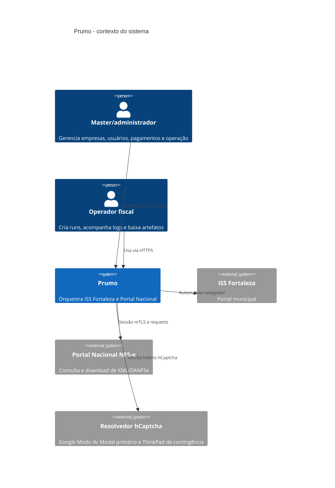
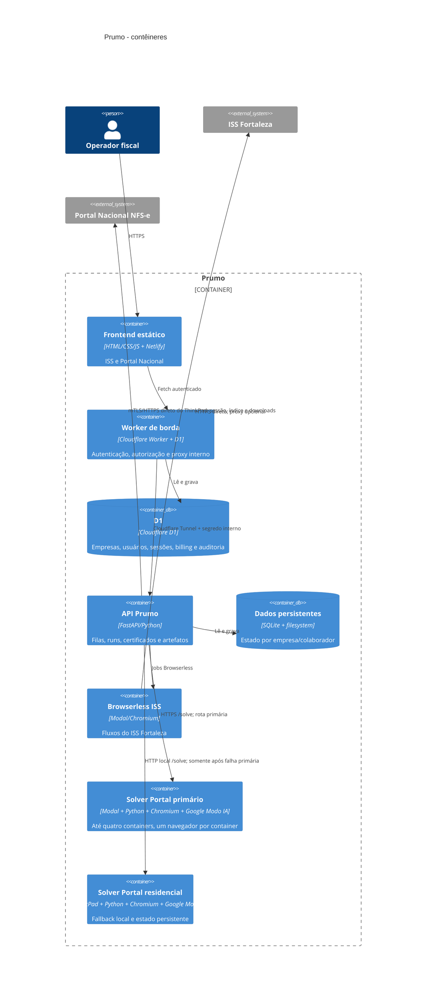
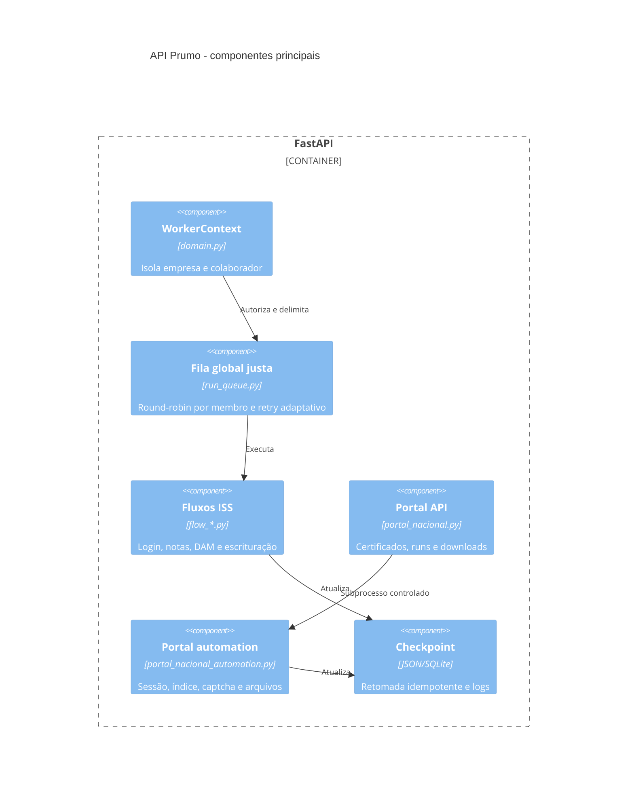

# C4 do Prumo

## Nível 1 - contexto

## Nível 2 - contêineres

## Nível 3 - componentes da API

## Decisões arquiteturais

- ISS usa Modal direto por padrão porque o A/B real mostrou menor latência e menos falhas DNS; a proxy continua como fallback.
- O ThinkPad autentica no Portal Nacional diretamente em `certificado.nfse.gov.br`, indexa as notas e baixa os arquivos. Apenas a resolução visual do hCaptcha vai para o Modal. Não há proxy no caminho normal do Portal.
- Se o solver Modal retornar falha, circuito aberto ou indisponibilidade, somente a resolução visual segue para `127.0.0.1:8876`. O PFX, a senha e a sessão do Portal nunca são enviados ao Modal.
- O único provedor visual é o Google Modo IA. Não há Florence nem Cohere. O código fica versionado em `solver/google_ai_mode`; estado anônimo fica em Volume privado no Modal e em `/opt/prumo/data/_api_data/google_ai_solver_state` no ThinkPad.
- O Modal mantém até quatro containers com um navegador por container. O Portal usa cooldown por endpoint e backoff crescente quando o serviço externo está degradado, sem consumir tentativas repetindo imediatamente um erro global.
- A UI do ISS consulta apenas 20 mil caracteres recentes; o servidor mantém cache incremental por CNPJ/fluxo para mostrar novos logs sem reler o arquivo inteiro.
- Certificados são validados antes de entrar na run; falha de descriptografia nunca vira senha vazia silenciosa.
