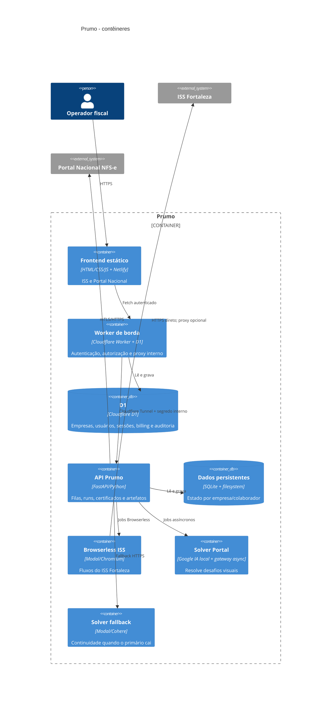
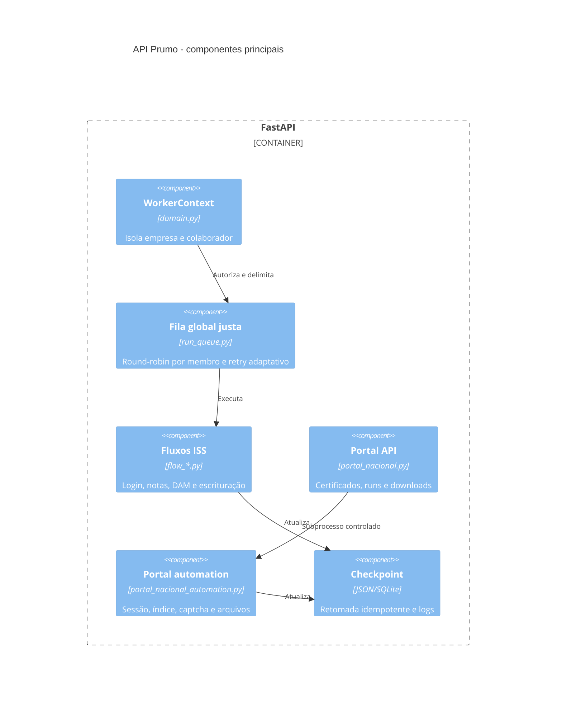

# C4 do Prumo

## Nível 1 - contexto

## Nível 2 - contêineres

## Nível 3 - componentes da API

## Decisões arquiteturais

- ISS usa Modal direto por padrão porque o A/B real mostrou menor latência e menos falhas DNS; a proxy continua como fallback.
- Portal mantém proxy brasileira e fallback de solver porque hCaptcha e Google são sensíveis à origem de rede.
- Solves residenciais longos usam criação de job e polling curto para evitar 524 da Cloudflare.
- O gateway residencial exige token, limita concorrência e expira jobs para reduzir abuso e consumo de memória.
- Timeouts e intervalos crescem com a tentativa, limitados por teto, para absorver dias ruins dos portais sem travar indefinidamente.
- Certificados são validados antes de entrar na run; falha de descriptografia nunca vira senha vazia silenciosa.
