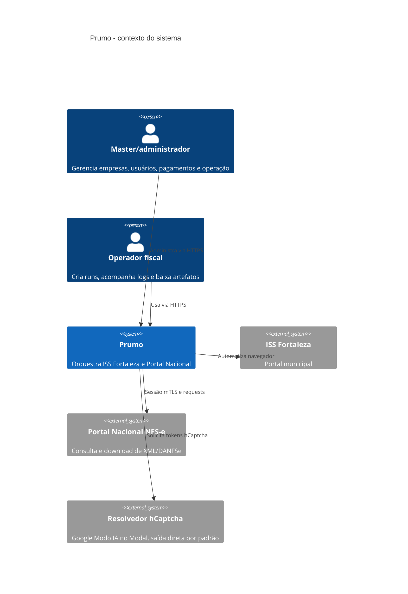
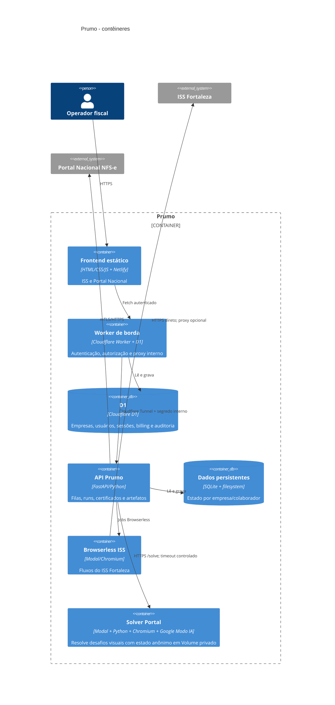
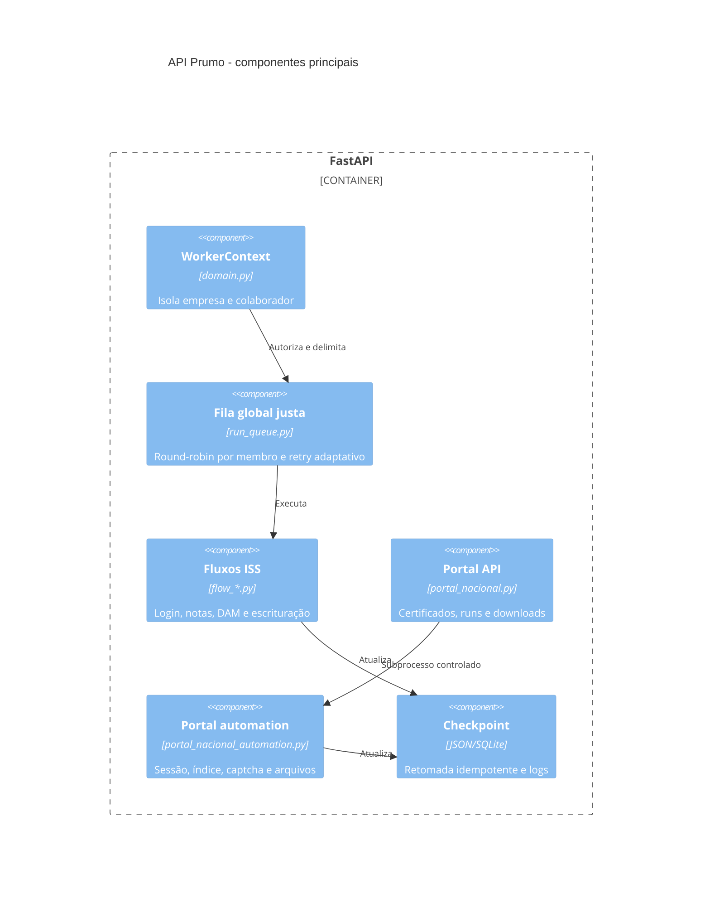

# C4 do Prumo

## Nível 1 - contexto

## Nível 2 - contêineres

## Nível 3 - componentes da API

## Decisões arquiteturais

- ISS usa Modal direto por padrão porque o A/B real mostrou menor latência e menos falhas DNS; a proxy continua como fallback.
- Portal também usa saída direta do Modal. A proxy do ThinkPad responde dentro do servidor, mas o acesso Modal -> Cloudflare Access exige autenticação de máquina; por isso ela permanece desativada até existir um service token próprio.
- O único provedor visual é o Google Modo IA. O código fica versionado em `solver/google_ai_mode`; o Volume Modal contém somente sessão anônima e artefatos, sem segredo de provedor no Git ou na imagem.
- O Portal serializa solves em um navegador e usa backoff global crescente, até 120 s, quando 429/503 ou circuit breaker indicam indisponibilidade geral.
- A UI do ISS consulta apenas 20 mil caracteres recentes; o servidor mantém cache incremental por CNPJ/fluxo para mostrar novos logs sem reler o arquivo inteiro.
- Certificados são validados antes de entrar na run; falha de descriptografia nunca vira senha vazia silenciosa.
