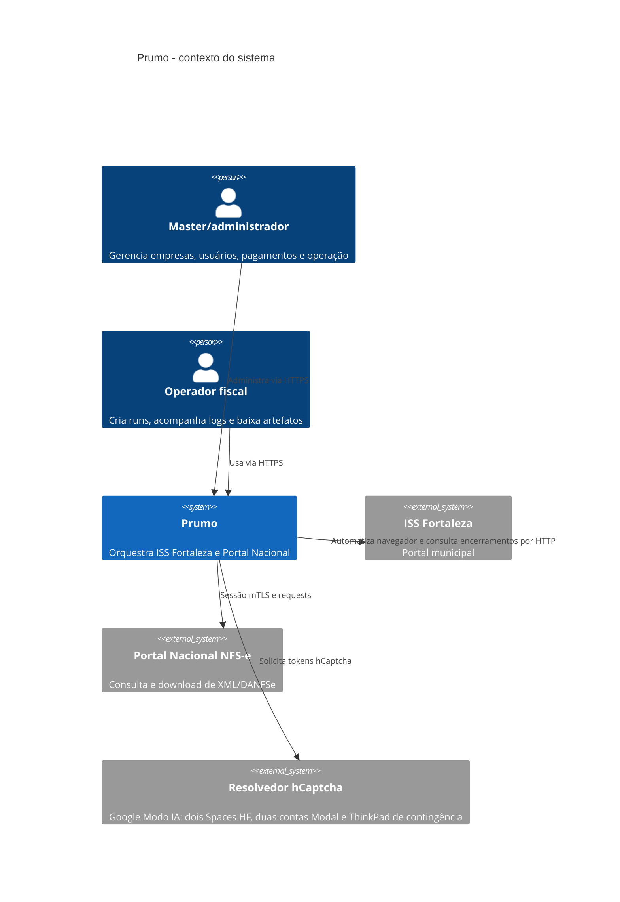
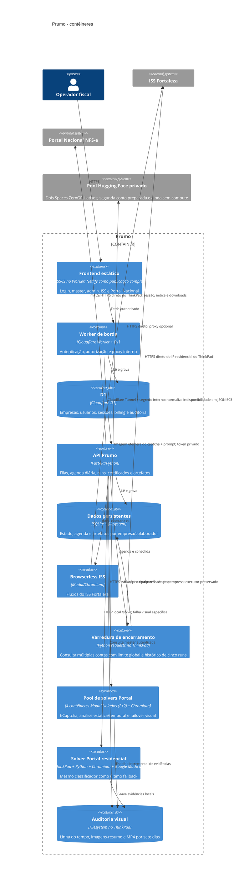
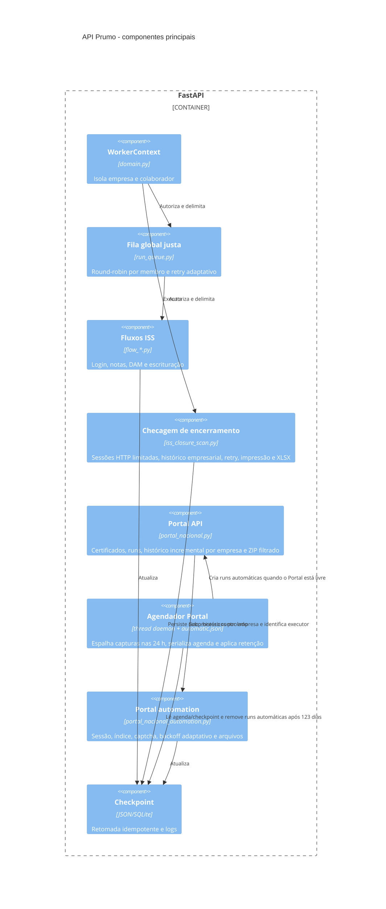
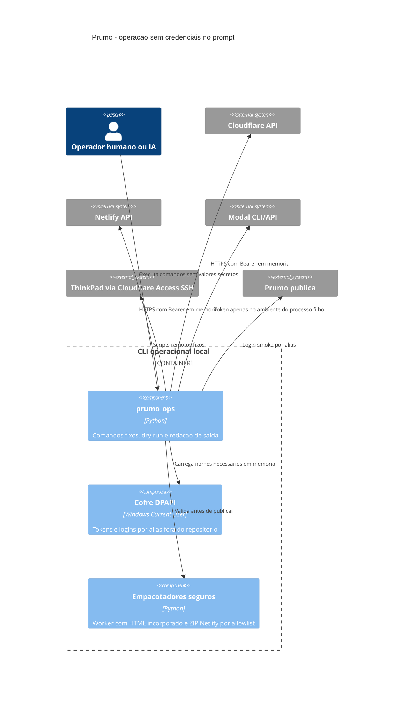

# C4 do Prumo

## Nível 1 - contexto

```mermaid
C4Context
  title Prumo - contexto do sistema
  Person(master, "Master/administrador", "Gerencia empresas, usuários, pagamentos e operação")
  Person(operador, "Operador fiscal", "Cria runs, acompanha logs e baixa artefatos")
  System(prumo, "Prumo", "Orquestra ISS Fortaleza e Portal Nacional")
  System_Ext(iss, "ISS Fortaleza", "Portal municipal")
  System_Ext(nfse, "Portal Nacional NFS-e", "Consulta e download de XML/DANFSe")
  System_Ext(ai, "Resolvedor hCaptcha", "Google Modo IA: dois Spaces HF, duas contas Modal e ThinkPad de contingência")
  Rel(master, prumo, "Administra via HTTPS")
  Rel(operador, prumo, "Usa via HTTPS")
  Rel(prumo, iss, "Automatiza navegador e consulta encerramentos por HTTP")
  Rel(prumo, nfse, "Sessão mTLS e requests")
  Rel(prumo, ai, "Solicita tokens hCaptcha")
```

## Nível 2 - contêineres

```mermaid
C4Container
  title Prumo - contêineres
  Person(operador, "Operador fiscal")
  Container_Boundary(prumo, "Prumo") {
    Container(ui, "Frontend estático", "HTML/CSS/JS no Worker; Netlify como publicação complementar", "Login, master, admin, ISS e Portal Nacional")
    Container(edge, "Worker de borda", "Cloudflare Worker + D1", "Autenticação, autorização e proxy interno")
    ContainerDb(d1, "D1", "Cloudflare D1", "Empresas, usuários, sessões, billing e auditoria")
    Container(api, "API Prumo", "FastAPI/Python", "Filas, agenda diária, runs, certificados e artefatos")
    ContainerDb(data, "Dados persistentes", "SQLite + filesystem", "Estado, agenda e artefatos por empresa/colaborador")
    Container(browser, "Browserless ISS", "Modal/Chromium", "Fluxos do ISS Fortaleza")
    Container(closure, "Varredura de encerramento", "Python requests no ThinkPad", "Consulta múltiplas contas com limite global e histórico de cinco runs")
    Container(solver, "Pool de solvers Portal", "4 contêineres Modal isolados (2+2) + Chromium", "hCaptcha, análise estática/temporal e failover visual")
    Container(solverLocal, "Solver Portal residencial", "ThinkPad + Python + Chromium + Google Modo IA", "Mesmo classificador como último fallback")
    ContainerDb(audit, "Auditoria visual", "Filesystem no ThinkPad", "Linha do tempo, imagens-resumo e MP4 por sete dias")
  }
  System_Ext(iss, "ISS Fortaleza")
  System_Ext(nfse, "Portal Nacional NFS-e")
  System_Ext(hf, "Pool Hugging Face privado", "Dois Spaces ZeroGPU ativos; segunda conta preparada e ainda sem compute")
  Rel(operador, ui, "HTTPS")
  Rel(ui, edge, "Fetch autenticado")
  Rel(edge, d1, "Lê e grava")
  Rel(edge, api, "Cloudflare Tunnel + segredo interno; normaliza indisponibilidade em JSON 503")
  Rel(api, data, "Lê e grava")
  Rel(api, browser, "Jobs Browserless")
  Rel(api, closure, "Agenda e consolida")
  Rel(browser, iss, "HTTPS direto; proxy opcional")
  Rel(closure, iss, "HTTPS direto do IP residencial do ThinkPad")
  Rel(closure, data, "Histórico compartilhado por empresa; executor preservado")
  Rel(api, nfse, "mTLS/HTTPS direto do ThinkPad; sessão, índice e downloads")
  Rel(api, solver, "HTTPS /solve; principal e reserva de quota")
  Rel(solver, hf, "Imagem efêmera do captcha + prompt; token privado")
  Rel(api, solverLocal, "HTTP local /solve; falha visual específica")
  Rel(solver, audit, "Espelho incremental de evidências")
  Rel(solverLocal, audit, "Grava evidências locais")
  Rel(api, audit, "Consulta master autenticada")
```

## Nível 3 - componentes da API

```mermaid
C4Component
  title API Prumo - componentes principais
  Container_Boundary(api, "FastAPI") {
    Component(auth, "WorkerContext", "domain.py", "Isola empresa e colaborador")
    Component(queue, "Fila global justa", "run_queue.py", "Round-robin por membro e retry adaptativo")
    Component(issFlows, "Fluxos ISS", "flow_*.py", "Login, notas, DAM e escrituração")
    Component(closureScan, "Checagem de encerramento", "iss_closure_scan.py", "Sessões HTTP limitadas, histórico empresarial, retry, impressão e XLSX")
    Component(portalApi, "Portal API", "portal_nacional.py", "Certificados, runs, histórico incremental por empresa e ZIP filtrado")
    Component(portalScheduler, "Agendador Portal", "thread daemon + automatic.json", "Espalha capturas nas 24 h, serializa agenda e aplica retenção")
    Component(portalFlow, "Portal automation", "portal_nacional_automation.py", "Sessão, índice, captcha, backoff adaptativo e arquivos")
    Component(checkpoint, "Checkpoint", "JSON/SQLite", "Retomada idempotente e logs")
  }
  Rel(auth, queue, "Autoriza e delimita")
  Rel(queue, issFlows, "Executa")
  Rel(auth, closureScan, "Autoriza e delimita")
  Rel(closureScan, checkpoint, "Persiste cinco históricos por empresa e identifica executor")
  Rel(portalApi, portalFlow, "Subprocesso controlado")
  Rel(portalScheduler, portalApi, "Cria runs automáticas quando o Portal está livre")
  Rel(portalScheduler, checkpoint, "Lê agenda/checkpoint e remove runs automáticas após 123 dias")
  Rel(issFlows, checkpoint, "Atualiza")
  Rel(portalFlow, checkpoint, "Atualiza")
```

## Nível 3 - plano operacional local

```mermaid
C4Component
  title Prumo - operacao sem credenciais no prompt
  Person(ai, "Operador humano ou IA")
  Container_Boundary(ops, "CLI operacional local") {
    Component(cli, "prumo_ops", "Python", "Comandos fixos, dry-run e redacao de saida")
    Component(vault, "Cofre DPAPI", "Windows Current User", "Tokens e logins por alias fora do repositorio")
    Component(bundle, "Empacotadores seguros", "Python", "Worker com HTML incorporado e ZIP Netlify por allowlist")
  }
  System_Ext(cf, "Cloudflare API")
  System_Ext(netlify, "Netlify API")
  System_Ext(modal, "Modal CLI/API")
  System_Ext(server, "ThinkPad via Cloudflare Access SSH")
  System_Ext(app, "Prumo publica")
  Rel(ai, cli, "Executa comandos sem valores secretos")
  Rel(cli, vault, "Carrega nomes necessarios em memoria")
  Rel(cli, bundle, "Valida antes de publicar")
  Rel(cli, cf, "HTTPS com Bearer em memoria")
  Rel(cli, netlify, "HTTPS com Bearer em memoria")
  Rel(cli, modal, "Token apenas no ambiente do processo filho")
  Rel(cli, server, "Scripts remotos fixos")
  Rel(cli, app, "Login smoke por alias")
```

## Decisões arquiteturais

- ISS usa Modal direto por padrão porque o A/B real mostrou menor latência e menos falhas DNS; a proxy continua como fallback.
- A checagem de encerramento do ISS não usa navegador: requests saem do ThinkPad em sessões independentes. Um semáforo de seis conexões vale para todos os usuários, cada conta usa até quatro sessões e no máximo duas contas são coordenadas em paralelo. Credenciais são carregadas somente em memória; o histórico guarda IDs/aliases e as cinco runs da empresa, visíveis a seus usuários e identificadas pelo executor. Impressão e XLSX são produzidos no cliente a partir do conjunto filtrado completo.
- O ThinkPad autentica no Portal Nacional diretamente em `certificado.nfse.gov.br`, indexa as notas e baixa os arquivos. Apenas a resolução visual do hCaptcha vai para o Modal. Não há proxy no caminho normal do Portal.
- Cada solver tenta primeiro os dois Spaces HF, distribuídos por hash e com circuito independente; depois usa o próprio egress Modal. Falha completa da conta principal segue para a segunda conta Modal e somente então para o ThinkPad. PFX, senha, cookies e arquivos fiscais nunca são enviados ao HF.
- O solver preserva a causa mais específica: falha da sessão Google Modo IA ou do navegador tenta a conta Modal reserva; somente uma classificação visual válida porém rejeitada segue diretamente ao ThinkPad. Isso evita esconder indisponibilidade do provedor sob o erro genérico de grade.
- O `/health` do solver é diagnóstico e nunca escolhe a rota da run inteira. Um container frio pode ultrapassar a leitura de 12 segundos durante o prewarm; o POST real mantém a rota principal e decide failover por captcha.
- Falha confirmada da sessão Google mantém cooldown de cinco minutos nos Modal para proteger crédito. No solver residencial, o mesmo evento usa 30 segundos: não há custo de Modal e o IP do ThinkPad costuma recuperar rapidamente.
- O único provedor visual é o Google Modo IA, acessado por egress Modal, HF ou residencial. Não há Florence nem Cohere e não há resolvedores separados para 9 tiles e outros formatos: um contrato visual único escolhe `selecionar_regioes` ou `clicar_ponto`; somente o adaptador mecânico de clique muda conforme o DOM. O código fica em `solver/google_ai_mode`.
- Cada conta Modal escala até dois contêineres, com um navegador e uma entrada ativa em cada um. As quatro tarefas são balanceadas 2+2; a sessão HTTP do Modo IA permanece viva entre etapas temporais. Widget preso ou sessão inválida sai cedo para o próximo endpoint, mantendo o ThinkPad por último.
- Modal e ThinkPad limitam cada solve a 360 segundos: estados vazios saem após duas leituras, enquanto uma sequência válida pode atravessar várias etapas temporais sem reiniciar em cada endpoint. Quadros temporais sem alvo são recapturados sem abrir cooldown; `solve_timeout` é preservado para diagnóstico. O circuito do provedor registra quando abriu e se rearma em 300 segundos.
- A concorrência do Portal é fixada pelo backend em quatro tarefas por colaborador e não é controlada pelo HTML. Cada colaborador tem runtime, sessão, certificado, índice e downloads próprios; dois colaboradores podem executar simultaneamente e compartilham apenas a capacidade enfileirada dos solvers.
- O XML concluído é checkpointado mesmo quando o PDF da mesma nota falha. O Modal recarrega e publica sessões Modo IA recuperadas no Volume privado; a recuperação Chrome usa uma tentativa curta e não ocupa todo o prazo do captcha. Logs e imagens são publicados periodicamente no Volume de debug e expiram em sete dias.
- O download agrupado do Portal une as runs filhas no backend e organiza o ZIP em `Recebidas|Emitidas/MM-AAAA/XML|PDF`, evitando múltiplos downloads e preservando a competência de notas retroativas.
- O agendador do Portal persiste cada configuração em `automatic.json` no escopo do colaborador, distribui os horários uniformemente pelas 24 horas e inicia no máximo uma captura automática global quando não há run do Portal ativa. A primeira janela começa na data escolhida e baixa XML+PDF; ciclos seguintes sobrepõem dois dias e somente runs automáticas vencidas são removidas após 123 dias.
- O histórico automático agrupa as runs filhas recebidas/emitidas pelo `batch_id`, deduplica notas por modo e identificador e mantém o resultado separado por certificado. Capturas com erro permanecem auditáveis. O download acumulado pode filtrar a data de emissão extraída do XML e a competência fiscal, sem misturar dados entre colaboradores.
- A autorização de `Capturar agora` usa o runtime `empresa:colaborador`: uma run ativa bloqueia somente aquele colaborador. O agendador diário continua globalmente serializado para reduzir disputa pelo Portal e pelo solver.
- A API de estado retorna listas de runs sem varrer XML/PDF/logs. Essa enumeração fica restrita ao detalhe selecionado, mantendo o custo da atualização da tela estável com quatro meses de histórico.
- Login, master, admin e Portal Nacional são servidos pelo mesmo Worker da API com `no-store`, evitando divergência de versão quando o Netlify está sem créditos ou há uma atualização operacional. O GitHub continua sendo a fonte; o auto-deploy Netlify pode voltar sem mudar a arquitetura.
- O Worker é a fronteira de erro da API: 530/1033 e respostas 5xx de infraestrutura nunca atravessam como HTML. Ele devolve JSON 503 rastreável e mantém o corpo de downloads válidos em streaming.
- A árvore física das runs ISS continua `CNPJ - Nome` para preservar retomadas. Somente o ZIP entregue ao usuário apresenta `Nome - CNPJ`, de forma idempotente e compatível com runs antigas.
- Artefatos visuais ficam por sete dias, mas HTML/JSON/texto são gzipados e PNG vira WebP lossless após 15 minutos. Os Volumes Modal retêm frames brutos; o ThinkPad espelha apenas resumos, MP4 e eventos. XML/PDF das empresas não entram nessa limpeza. Logs Docker têm rotação de 3 arquivos de 10 MiB.
- A UI do ISS consulta apenas 20 mil caracteres recentes; o servidor mantém cache incremental por CNPJ/fluxo para mostrar novos logs sem reler o arquivo inteiro.
- Certificados são validados antes de entrar na run; falha de descriptografia nunca vira senha vazia silenciosa.
- Operacao local usa `python -m ops.prumo_ops`: o cofre DPAPI fica fora do Git, Cloudflare e Netlify usam API REST, Modal recebe token somente no ambiente filho e logins sao referenciados por alias. Wrangler e troca global de perfil Modal nao fazem parte do caminho canonico.
- No Portal Nacional, o ThinkPad divide o período por mês em janelas inclusivas de até 30 dias, limite aceito pelo site. Cada janela só é aceita quando a quantidade de IDs capturados coincide com o total do Portal; depois os IDs são unidos e deduplicados. A competência não é filtrada, portanto notas retroativas permanecem no resultado.
- Na API 1.0.59, a competência fiscal é extraída de `dCompet` no XML e agregada no resumo da run. O download permite uma, várias ou todas as competências; quando há mais de uma, o ZIP separa `MM-AAAA/XML` e `MM-AAAA/PDF` e não inclui logs ou arquivos internos.
- Na API 1.0.60, HTTP 429/500/502/503/504 do Portal é classificado como indisponibilidade externa e mantém a indexação em backoff crescente, em vez de confundir a falha com certificado, captcha ou nota.
