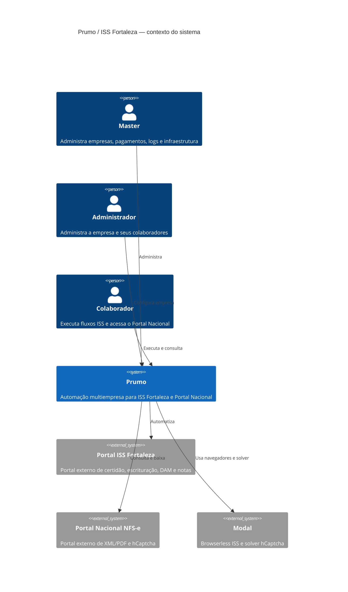
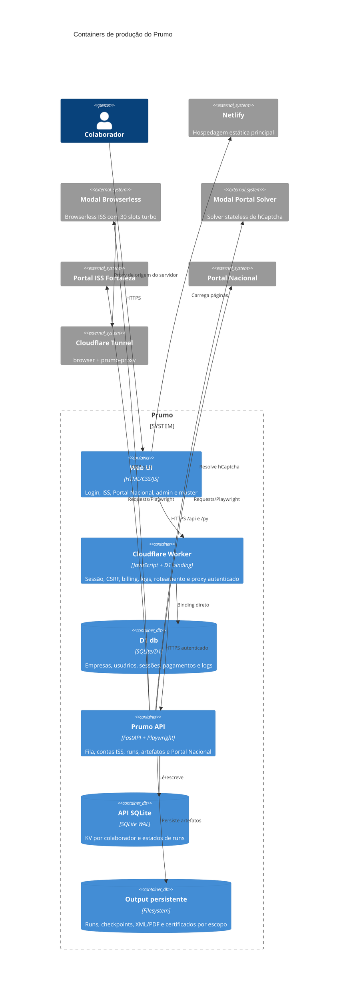
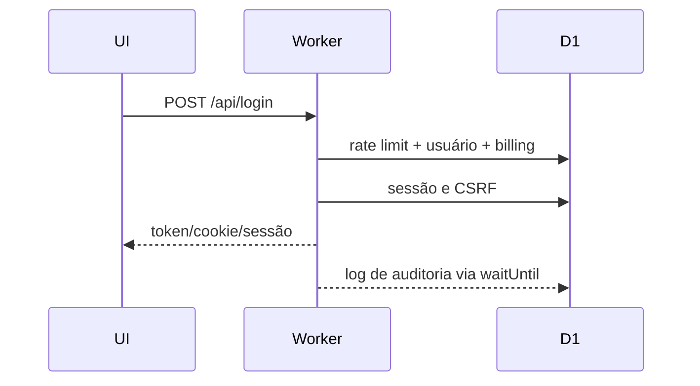
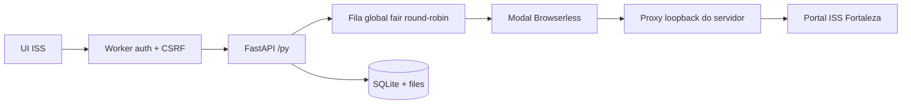
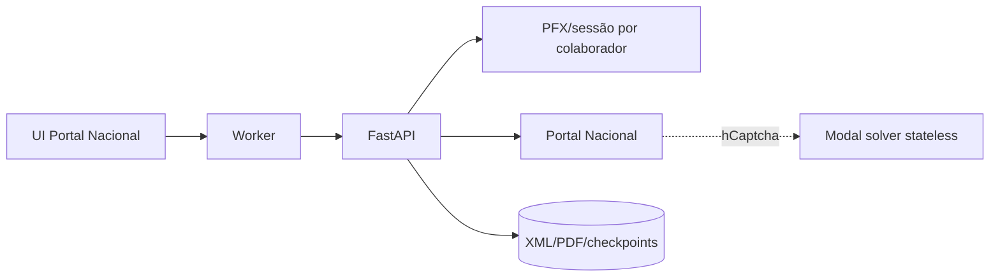

# C4 — Arquitetura do Prumo

Snapshot baseado no código local e na inspeção de produção de 2026-07-10. Valores secretos, certificados, cookies e credenciais foram omitidos.

## Nível 1 — Contexto

## Nível 2 — Containers

## Nível 3 — Fluxos principais

### Login

### ISS Fortaleza

### Portal Nacional — preservado nesta rodada

## Limites de confiança

- O Worker é a fronteira pública de autenticação para a API ISS.
- `prumo-api` e Browserless local não devem ser publicados em interface externa.
- O túnel `browser` é separado do túnel `prumo-proxy`; eles não devem ser fundidos sem validar os hostnames.
- O Modal é stateless para o solver do Portal Nacional; certificados, sessões e arquivos finais ficam no escopo do servidor.
